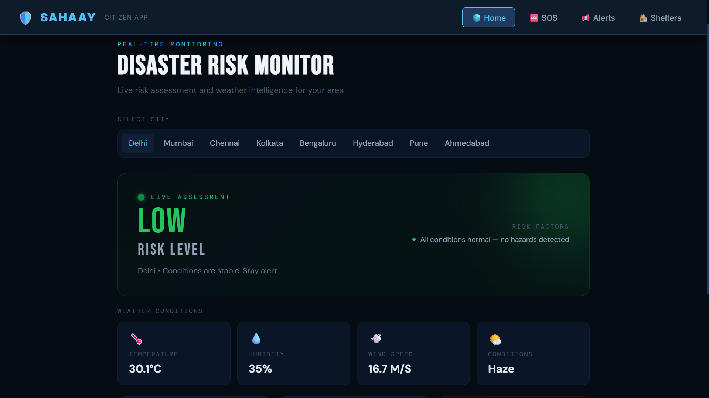
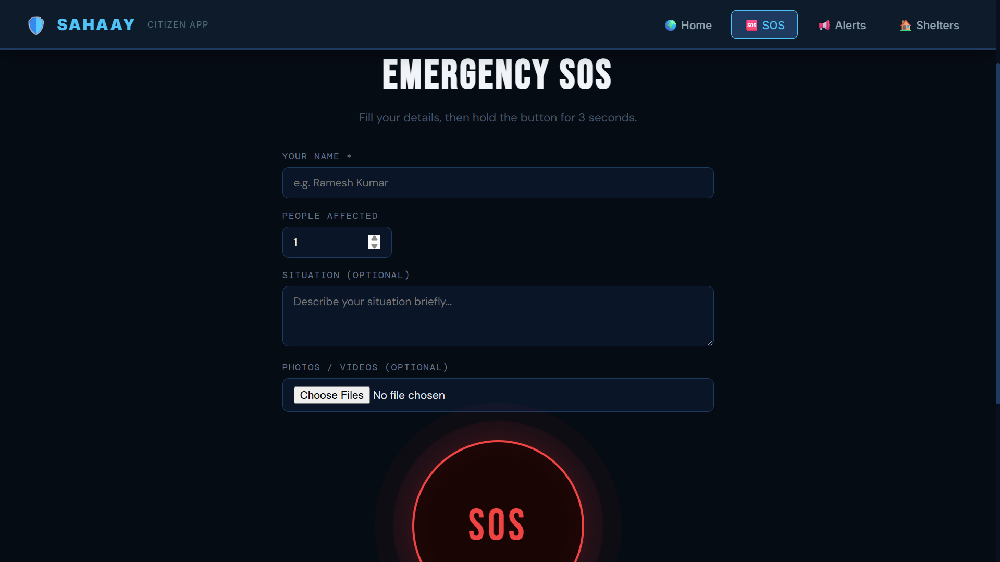
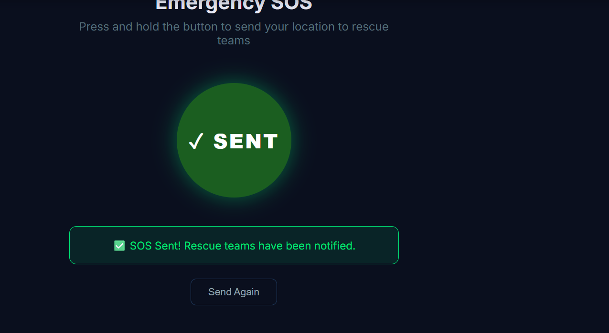
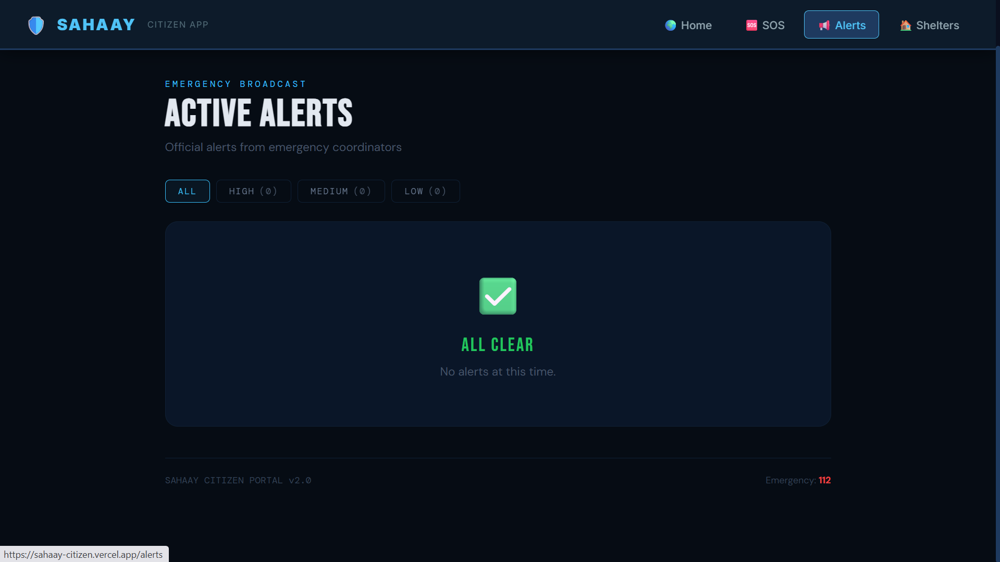
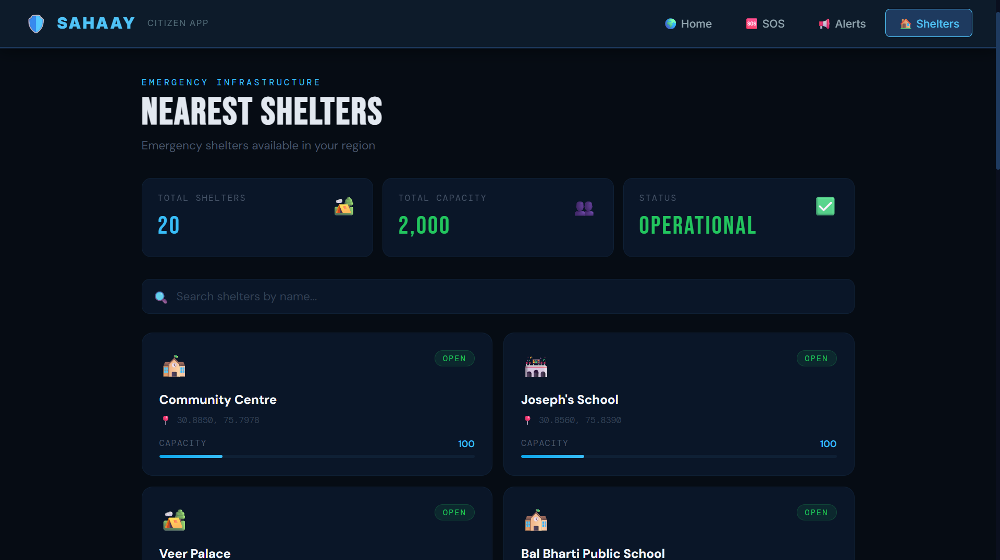

# 🆘 SAHAAY — Citizen Emergency App

<div align="center">


**Emergency SOS app for citizens during natural disasters**

[🔴 Live App](https://sahaay-citizen.vercel.app) • [🛡️ Admin Dashboard](https://sahaay-jet.vercel.app) • [📖 API Docs](https://sahaay-production.up.railway.app/docs)

</div>

---

## 📱 Pages

| Page | Description |
|------|-------------|
| 🏠 **Dashboard** | Live disaster risk monitor with city-wise AI predictions |
| 🆘 **SOS** | Emergency SOS button with GPS tracking and media upload |
| 🔔 **Alerts** | Real-time disaster alerts for your area |
| 🏠 **Shelters** | Nearby emergency shelters via OpenStreetMap |

---
## 📸 Screenshots

### Dashboard


### SOS Page



### Alerts


### Shelters


---
## ✨ Features

### 🆘 Emergency SOS
- **Hold-to-send** button — hold 3 seconds to prevent accidental triggers
- **Auto GPS location** — captures exact coordinates on send
- **Live location tracking** — updates rescue teams every 10 seconds
- **Media upload** — attach photos/videos of the situation
- **People count** — specify how many people need help
- **Situation description** — brief message to rescue teams
- **Visual feedback** — circular progress ring, success/error states

### 📊 Disaster Risk Monitor
- **AI-powered predictions** for 4 disaster types
  - 🌊 Flood
  - 🌍 Earthquake
  - 🔥 Heatwave
  - 💨 Air Quality
- **Live weather data** — temperature, humidity, wind, rainfall
- **City selector** — Delhi, Mumbai, Chennai, Kolkata, Bengaluru, Hyderabad, Pune, Ahmedabad
- **Risk level display** — LOW / MEDIUM / HIGH / CRITICAL with confidence scores

### 🔔 Alerts
- **Real-time disaster alerts** from admin dashboard
- **Severity indicators** — color-coded by risk level
- **Zone-specific** alerts for your city
- **Timestamp** for each alert

### 🏠 Shelters
- **Nearest shelters** via OpenStreetMap Overpass API
- **Live distance** from your current location
- **Shelter type** — school, community centre, assembly point
- **Capacity information**
- **Google Maps link** for directions

### 📞 Emergency Contacts
- **112** — National Emergency
- **1078** — NDMA Helpline
- **1070** — Disaster Management
- **One-tap calling** from any page

---

## 🏗️ Tech Stack

| Layer | Technology |
|-------|-----------|
| **Frontend** | React 18, Vite |
| **Styling** | Custom CSS, DM Sans, Bebas Neue fonts |
| **HTTP Client** | Axios |
| **Maps** | OpenStreetMap Overpass API |
| **Location** | Browser Geolocation API |
| **Deploy** | Vercel |
| **Backend** | FastAPI on Railway |
| **Database** | PostgreSQL on Railway |

---

## 🚀 Getting Started

### Prerequisites
- Node.js 18+
- Backend running (see [Admin Dashboard repo](https://github.com/vanshrana2k5/Sahaay))

### Setup
```bash
# Clone the repo
git clone https://github.com/vanshrana2k5/sahaay-citizen.git
cd sahaay-citizen

# Install dependencies
npm install

# Create environment file
echo "VITE_API_URL=http://localhost:8000" > .env

# Start development server
npm run dev
```

### Build for Production
```bash
npm run build
```

---

## 🌐 Live Deployment

| Service | URL |
|---------|-----|
| 🆘 Citizen App | https://sahaay-citizen.vercel.app |
| 🛡️ Admin Dashboard | https://sahaay-jet.vercel.app |
| ⚡ Backend API | https://sahaay-production.up.railway.app |
| 📖 API Docs | https://sahaay-production.up.railway.app/docs |

---

## 📁 Project Structure

```
sahaay-citizen/
├── src/
│   ├── pages/
│   │   ├── Home.jsx        # Disaster risk monitor
│   │   ├── SOS.jsx         # Emergency SOS button
│   │   ├── Alerts.jsx      # Disaster alerts
│   │   └── Shelters.jsx    # Nearby shelters
│   ├── components/
│   │   └── Navbar.jsx      # Navigation bar
│   ├── config.js           # API base URL config
│   ├── App.jsx             # Router setup
│   └── main.jsx            # Entry point
├── public/
├── vercel.json             # Vercel routing config
├── .env.production         # Production env vars
└── package.json
```

---

## 🔌 API Integration

| Endpoint | Used In |
|----------|---------|
| `POST /sos` | SOS submission |
| `PUT /sos/{id}/location` | Live GPS tracking |
| `POST /sos/{id}/media` | Media upload |
| `GET /predict/{city}` | Risk predictions |
| `GET /alerts` | Disaster alerts |
| `GET /shelters` | Nearby shelters |
| `GET /weather/{city}` | Live weather |

---

## 🆘 How SOS Works

```
Citizen fills form (name, people count, message)
         ↓
Holds SOS button for 3 seconds
         ↓
App captures GPS coordinates
         ↓
SOS sent to backend → stored in PostgreSQL
         ↓
Admin dashboard shows SOS in real-time via WebSocket
         ↓
GPS location updates every 10 seconds
         ↓
Rescue team assigned → dispatched to location
```

---

## 👨‍💻 Team

| Name | Role |
|------|------|
| **Vansh Rana** | Full Stack Developer |
| **Mansi** | Full Stack Developer |

---

## 📄 License

This project is built for educational and humanitarian purposes.

---

<div align="center">

**Built with ❤️ to help citizens during emergencies**

⭐ Star this repo if you find it useful!

</div>
